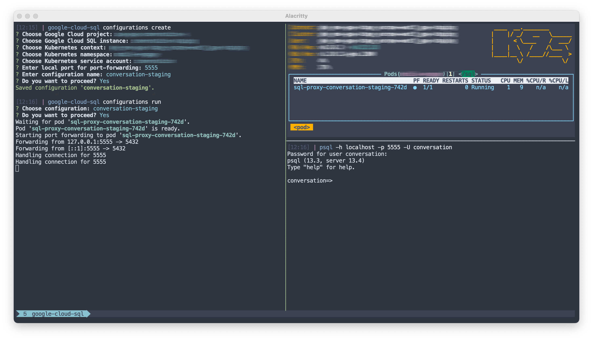

:toc: macro
:toc-title:
:toclevels: 10

= ⛅ google-cloud-sql

image:https://img.shields.io/github/package-json/v/edosrecki/google-cloud-sql-cli/master?color=blue&label=google-cloud-sql["google-cloud-sql CLI Version"]
image:https://img.shields.io/github/workflow/status/edosrecki/google-cloud-sql-cli/Continuous Integration["Build Status", link="https://github.com/edosrecki/google-cloud-sql-cli/actions"]

A CLI app which establishes a connection to a private Google Cloud SQL instance and port-forwards it to a local machine.

Connection is established by running a Google Cloud SQL Auth Proxy pod in a Google Kubernetes Engine cluster which runs in the same VPC network as the private Cloud SQL instance. Connection is then port-forwarded to the local machine, where a user can connect to the instance on localhost. **Corresponding workload identity has to be configured in the cluster, with service account which has Cloud SQL Client role on the given SQL instance.** Configurations in the app can be saved for practical future usage.

The app relies on local `gcloud` and `kubectl` commands which have to be configured and authenticated with the proper Google Cloud user and GKE Kubernetes cluster.

---

toc::[]

== Install
=== Homebrew
[source,bash]
----
brew install edosrecki/tools/google-cloud-sql

# Update
brew upgrade google-cloud-sql
----

=== Releases
Download a corresponding distribution from https://github.com/edosrecki/google-cloud-sql-cli/releases[Releases] and add
the executable to your `PATH`.

=== Build from source
Build the app from source by building and packaging it manually: see _Build_ and
_Package_ sections.

== Use
=== Prerequisites
* Install https://cloud.google.com/sdk/docs/install[`gcloud`] tool
* Install https://kubernetes.io/docs/tasks/tools/#kubectl[`kubectl`] tool
* Authenticate to Google Cloud: `gcloud auth login`
* Get GKE cluster credentials: `gcloud container clusters get-credentials`
* https://cloud.google.com/kubernetes-engine/docs/how-to/workload-identity[Configure workload identity] in GKE namespace(s) and assign _Cloud SQL Client_ role in IAM for Cloud SQL instances that you want to use
* Enable Cloud SQL Admin API for project(s) that host Cloud SQL instances that you want to use: `gcloud services enable sqladmin.googleapis.com --project=$PROJECT`

=== Run
[source,bash]
----
# Help
google-cloud-sql help

# Create (or override existing) configuration
google-cloud-sql configurations create

# Run configuration (interactive mode)
google-cloud-sql configurations run

# Run configuration (non-interactive mode)
google-cloud-sql configurations run $NAME

# HINT: Add alias
alias myDbProd="google-cloud-sql configurations run $NAME"

## Connect to the instance on localhost
psql -h localhost -p $LOCAL_PORT -U $USER

# Export configurations (and share :-])
cat $(google-cloud-sql configurations path)
----

== Build
[source,bash]
----
npm run clean
npm run build
----

== Package
=== Pre-configured
Package the app for Node.JS 16 on MacOS, Linux, and Windows.

[source,bash]
----
npm run bundle
----

=== Manual
See https://www.npmjs.com/package/pkg#targets[pkg] for details.

[source,bash]
----
npx pkg <NODE_RANGE>-<PLATFORM>-<ARCH>
----

== Deploy
To deploy a new version of `google-cloud-sql` app, manually run a https://github.com/edosrecki/google-cloud-sql-cli/actions/workflows/continuous-deployment.yml["Continuous Deployment"] worklow in GitHub Actions.

== Todo
* Add snap for Linux
* Add completions
* Cache user's running pods, and alert user on next startup if they were not cleaned up on previous app exit.
